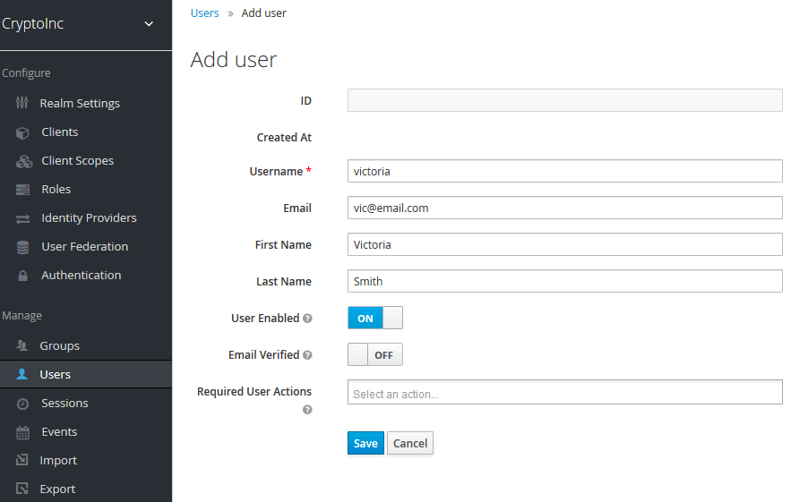
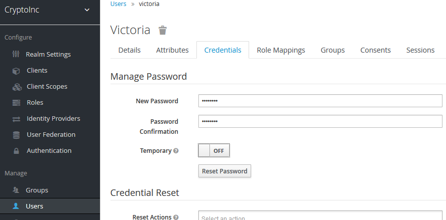
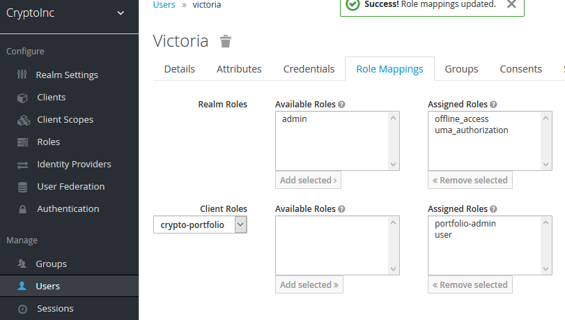

# Demo for Pluralsight Course "Microservices Security Fundumentals"

## Prerequisites

- Docker:  https://www.docker.com/ 
- Docker compose: https://docs.docker.com/compose/install/ 

## Starting the Demo

### Checkout the code

Navigate the the demo directory of the checkout.

### Keycloak
```
docker-compose up -d keycloak
```
You need to edit your hosts file to include the line:
in Ubuntu its generally in: ```/etc/hosts```
windows: ```C:\Windows\System32\drivers\etc```
```127.0.0.1 keycloak```

Once keycloak starts, access the keycloak admin console: http://keycloak:8081
login with `admin/password`
You need to create a user to login to the application.

> Manage -> User -> Add User
Fill in username, email, first and last name.

> Then in credentials set a new password, switch temporary to OFF.

> Now we need to add the user roles, 
Role Mappings -> Client Roles
Select crypto-portfolio
Then move:
- portfolio-admin
- user
From Available Roles to Assgined Roles.


### Kong API Gateway

    docker-compose up -d kong-db

    docker-compose run --rm kong kong migrations bootstrap

    docker-compose up -d kong

    docker-compose up -d konga

### Configuring Kong via Konga
http://localhost:1337
Register and login to Konga which is a GUI management for kong.
Then under: `Application -> Snapshots`
Import the konga_`snapshot.json` file this will setup the services and routes.

### Starting our microservices

    docker-compose up -d pricing-service
    
    docker-compose up -d portfolio-service
    
    docker-compose up -d support-service

### Confidential Client (Server side web application)

    docker-compose up -d ui-mvc-service
   http://localhost:8080/portfolio

### Public client SPA (React) 

    docker-compose up -d ui-service-bff
    
    docker-compose up -d crypto-portfolio-react

http://localhost:3000/portfolio

